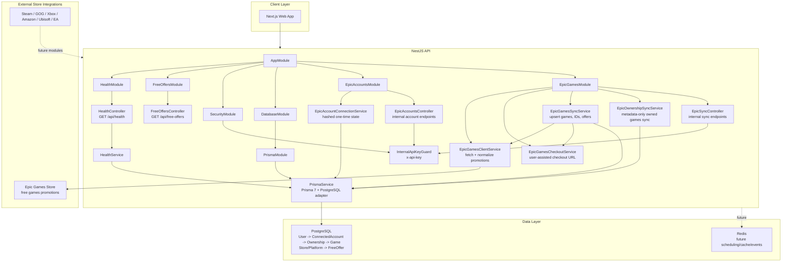

# ClaimWeekGames Architecture

ClaimWeekGames is designed as a modular NestJS and Next.js application for tracking free game offers and user-owned games across digital stores.

## System Modules

The backend is organized by feature modules. Controllers stay thin, services contain business logic, and persistence goes through Prisma.

- `DatabaseModule` owns database access and exports Prisma infrastructure.
- `HealthModule` exposes application and database health checks.
- `EpicAccountsModule` owns secure Epic account connection state and connected-account registration.
- `EpicGamesModule` is the first store integration and the highest-priority synchronization path.
- Future store modules should follow the same shape as Epic Games: one module per store, store-specific services, and shared library ownership handled outside the store module.

Expected future modules include `SteamModule`, `GogModule`, `XboxModule`, `AmazonGamesModule`, `UbisoftConnectModule`, `EaAppModule`, `LibraryModule`, `NotificationModule`, and `SchedulerModule`.

## Architecture Diagram

## Data Model

The current Prisma schema separates game metadata from ownership and store platforms:

- `Game` stores canonical game metadata such as title, slug, developer, and publisher.
- `Platform` stores digital stores such as Epic Games Store or Steam. It currently represents the Store concept.
- `User` stores application users.
- `ConnectedAccount` links a user to a platform account without storing credentials. This is the boundary for multi-account support.
- `AccountConnectionState` stores a hashed, one-time, expiring state token used during account onboarding. Raw state values are returned to the caller but never persisted.
- `Ownership` links a connected account to a game. Ownership is intentionally separate from `Game` because the same game can exist on multiple stores and multiple accounts.
- `FreeGameOffer` tracks detected free-game windows per game and platform.
- `ExternalGameId` maps platform-specific game identifiers to canonical `Game` records.

This model supports duplicate detection by normalizing games while preserving platform-specific ownership records.

## Synchronization Flow

Store synchronization should follow a consistent pipeline:

1. Fetch store data from the integration source.
2. Normalize external game and offer metadata into internal types.
3. Resolve or create the `Platform`.
4. Match or create `Game` records using stable identifiers and normalized slugs.
5. Upsert `FreeGameOffer` records for weekly and historical offers.
6. Upsert `Ownership` records for authenticated user libraries.
7. Emit domain events for notifications and downstream processing.

Epic Games is the first implementation target. Its service foundation currently ensures the Epic Games Store platform exists and provides a place to add weekly offer, historical offer, owned game, multi-account, and duplicate-detection workflows.

Account connection starts with one-time hashed state records and stores only account metadata. Claiming starts with user-assisted checkout links rather than password-based automation. This keeps Epic credentials out of ClaimWeekGames while preserving a path to add device-code based account flows later.

Epic ownership synchronization currently accepts normalized ownership metadata and persists it for an active Epic `ConnectedAccount`. It does not fetch private Epic library data or store credentials; authenticated library retrieval remains blocked on a reviewed auth/session design.

Public read endpoints are separated from internal mutation endpoints. Internal sync and account-connection endpoints require the `x-api-key` header to match `INTERNAL_API_KEY`; if the key is missing from configuration, the endpoints deny access.

## Future Integrations

New stores should be added as independent modules with store-specific API clients and sync services. Shared concepts such as canonical game matching, ownership, scheduling, and notifications should live in shared feature modules rather than being duplicated across store modules.

Notifications should be event-driven so email, Discord, and push notification channels can subscribe to offer and ownership events without coupling directly to store integrations.
