# ClaimWeekGames Architecture

ClaimWeekGames is designed as a modular NestJS and Next.js application for tracking free game offers and user-owned games across digital stores.

## System Modules

The backend is organized by feature modules. Controllers stay thin, services contain business logic, and persistence goes through Prisma.

- `DatabaseModule` owns database access and exports Prisma infrastructure.
- `HealthModule` exposes application and database health checks.
- `AuthModule` owns opaque application sessions and authenticated-user request context.
- `EpicAccountsModule` owns secure Epic account connection state and connected-account registration.
- `EpicGamesModule` is the first store integration and the highest-priority synchronization path.
- `SchedulerModule` owns Nest Schedule registration and scheduled store synchronization jobs.
- Future store modules should follow the same shape as Epic Games: one module per store, store-specific services, and shared library ownership handled outside the store module.

Expected future modules include `SteamModule`, `GogModule`, `XboxModule`, `AmazonGamesModule`, `UbisoftConnectModule`, `EaAppModule`, `LibraryModule`, and `NotificationModule`.

## Architecture Diagram

```mermaid
flowchart TB
  subgraph Client["Client Layer"]
    Web["Next.js Web App"]
  end

  subgraph Api["NestJS API"]
    AppModule["AppModule"]
    HealthModule["HealthModule"]
    FreeOffersModule["FreeOffersModule"]
    AuthModule["AuthModule"]
    SecurityModule["SecurityModule"]
    DatabaseModule["DatabaseModule"]
    PrismaModule["PrismaModule"]
    EpicAccountsModule["EpicAccountsModule"]
    EpicGamesModule["EpicGamesModule"]
    SchedulerModule["SchedulerModule"]

    HealthController["HealthController\nGET /api/health"]
    FreeOffersController["FreeOffersController\nGET /api/free-offers"]
    AuthController["AuthController\nGET /api/me\ninternal sessions"]
    EpicSyncController["EpicSyncController\ninternal sync endpoints"]
    EpicAccountsController["EpicAccountsController\ninternal account endpoints"]
    HealthService["HealthService"]
    AuthService["AuthService\nopaque sessions"]
    AuthenticatedUserGuard["AuthenticatedUserGuard\nBearer token"]
    InternalApiKeyGuard["InternalApiKeyGuard\nx-api-key"]
    PrismaService["PrismaService\nPrisma 7 + PostgreSQL adapter"]
    EpicAccountConnection["EpicAccountConnectionService\nhashed one-time state"]
    EpicClient["EpicGamesClientService\nfetch + normalize promotions"]
    EpicCheckout["EpicGamesCheckoutService\nuser-assisted checkout URL"]
    EpicSync["EpicGamesSyncService\nupsert games, IDs, offers"]
    EpicOwnershipSync["EpicOwnershipSyncService\nmetadata-only owned games sync"]
    EpicScheduler["EpicFreeOffersSchedulerService\nconfigurable Thursday 18:00 Bratislava"]
  end

  subgraph Stores["External Store Integrations"]
    EpicStore["Epic Games Store\nfree games promotions"]
    FutureStores["Steam / GOG / Xbox / Amazon / Ubisoft / EA"]
  end

  subgraph Data["Data Layer"]
    Postgres["PostgreSQL\nUser -> UserSession\nUser -> ConnectedAccount -> Ownership -> Game\nStore -> FreeOffer\nStore -> SyncJob\nPlayPlatform future catalog"]
    Redis["Redis\nfuture cache/events"]
  end

  Web --> Api
  AppModule --> HealthModule
  AppModule --> FreeOffersModule
  AppModule --> AuthModule
  AppModule --> SecurityModule
  AppModule --> DatabaseModule
  AppModule --> EpicAccountsModule
  AppModule --> EpicGamesModule
  AppModule --> SchedulerModule
  DatabaseModule --> PrismaModule
  PrismaModule --> PrismaService
  HealthModule --> HealthController
  FreeOffersModule --> FreeOffersController
  HealthController --> HealthService
  HealthService --> PrismaService
  AuthModule --> AuthController
  AuthModule --> AuthService
  AuthModule --> AuthenticatedUserGuard
  AuthController --> AuthenticatedUserGuard
  AuthController --> InternalApiKeyGuard
  AuthService --> PrismaService
  SecurityModule --> InternalApiKeyGuard
  EpicAccountsModule --> EpicAccountConnection
  EpicAccountsModule --> EpicAccountsController
  EpicAccountsController --> InternalApiKeyGuard
  EpicAccountConnection --> PrismaService
  EpicGamesModule --> EpicClient
  EpicGamesModule --> EpicCheckout
  EpicGamesModule --> EpicSync
  EpicGamesModule --> EpicOwnershipSync
  EpicGamesModule --> EpicSyncController
  EpicSyncController --> InternalApiKeyGuard
  EpicSync --> EpicClient
  EpicSync --> EpicCheckout
  EpicOwnershipSync --> PrismaService
  SchedulerModule --> EpicScheduler
  EpicScheduler --> EpicSync
  EpicClient --> EpicStore
  EpicSync --> PrismaService
  PrismaService --> Postgres
  FutureStores -.future modules.-> Api
```

## Data Model

The current Prisma schema separates game metadata from ownership and stores:

- `Game` stores canonical game metadata such as title, slug, developer, and publisher.
- `Store` stores digital stores such as Epic Games Store or Steam.
- `PlayPlatform` is a future-ready playable platform catalog. It is not wired deeply into game metadata yet.
- `SyncJob` records synchronization attempts, status, timing, store scope, optional connected-account scope, and error metadata.
- `User` stores application users.
- `UserSession` stores hashed opaque bearer sessions for authenticated application access.
- `ConnectedAccount` links a user to a store account without storing credentials. This is the boundary for multi-account support.
- `AccountConnectionState` stores a hashed, one-time, expiring state token used during account onboarding. Raw state values are returned to the caller but never persisted.
- `Ownership` links a connected account to a game. Ownership is intentionally separate from `Game` because the same game can exist on multiple stores and multiple accounts.
- `FreeGameOffer` tracks detected free-game windows per game and store.
- `ExternalGameId` maps store-specific game identifiers to canonical `Game` records.

This model supports duplicate detection by normalizing games while preserving store-specific ownership records.

## Synchronization Flow

Store synchronization should follow a consistent pipeline:

1. Resolve or create the `Store`.
2. Create a `PENDING` `SyncJob`.
3. Mark the `SyncJob` as `RUNNING` with `startedAt`.
4. Fetch store data from the integration source.
5. Normalize external game and offer metadata into internal types.
6. Match or create `Game` records using stable identifiers and normalized slugs.
7. Upsert `ExternalGameId` and `FreeGameOffer` records for weekly and historical offers.
8. Upsert `Ownership` records for authenticated user libraries.
9. Mark the `SyncJob` as `SUCCEEDED` or `FAILED`.
10. Emit domain events for notifications and downstream processing.

Epic Games is the first implementation target. Its weekly free-offer sync currently ensures the Epic Games Store exists, records a `SyncJob`, fetches current/upcoming promotions, normalizes games, upserts external IDs and free-offer windows, and stores source, timing, duration, and creation/update counters in job metadata.

The scheduled Epic free-offer path uses `@nestjs/schedule`. `SchedulerModule` registers a cron job for every Thursday at 18:00 Europe/Bratislava time by default. The schedule can be changed with `EPIC_FREE_OFFERS_SYNC_CRON` and `EPIC_FREE_OFFERS_SYNC_TIMEZONE`, and registration can be controlled with `EPIC_FREE_OFFERS_SYNC_ENABLED`. In `NODE_ENV=test`, scheduler infrastructure is not imported unless explicitly enabled. The scheduler delegates to the same `EpicGamesSyncService` used by the manual internal endpoint, so manual and automated runs share persistence, idempotency, `SyncJob` creation, failure recording, and result counters.

The Next.js web app currently exposes a minimal public dashboard that reads `GET /api/free-offers` through `NEXT_PUBLIC_API_BASE_URL`. It shows current offer title, store, start date, end date, and derived active/upcoming/expired status without exposing internal sync job data.

Account connection starts with one-time hashed state records and stores only account metadata. Claiming starts with user-assisted checkout links rather than password-based automation. This keeps Epic credentials out of ClaimWeekGames while preserving a path to add device-code based account flows later.

Epic ownership synchronization currently accepts normalized ownership metadata and persists it for an active Epic `ConnectedAccount`. It does not fetch private Epic library data or store credentials; authenticated library retrieval remains blocked on a reviewed auth/session design.

Public read endpoints are separated from internal mutation endpoints. Internal sync and account-connection endpoints require the `x-api-key` header to match `INTERNAL_API_KEY`; if the key is missing from configuration, the endpoints deny access.

Authenticated user endpoints use opaque bearer sessions. Raw session tokens are returned once, stored only as SHA-256 hashes, and rejected after expiration or revocation. Public account-connection endpoints should use this guard once the user-facing flow is implemented.

## Future Integrations

New stores should be added as independent modules with store-specific API clients and sync services. Shared concepts such as canonical game matching, ownership, scheduling, and notifications should live in shared feature modules rather than being duplicated across store modules.

Notifications should be event-driven so email, Discord, and push notification channels can subscribe to offer and ownership events without coupling directly to store integrations.
