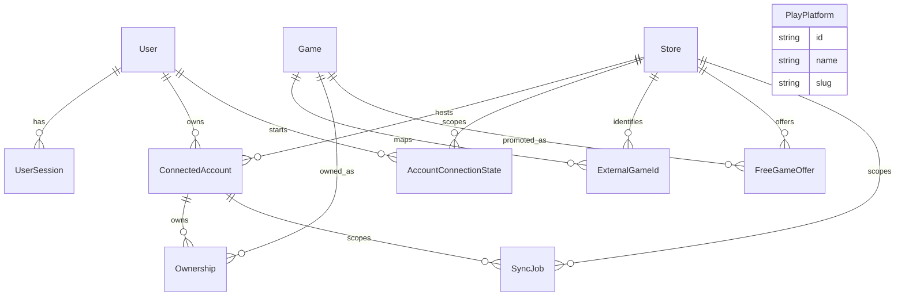

# Database

Database: PostgreSQL

ORM: Prisma 7

## Core Model

```text
User
  -> UserSession
  -> ConnectedAccount
    -> Ownership
      -> Game

Store
  -> ConnectedAccount
  -> FreeGameOffer
  -> ExternalGameId
  -> SyncJob

ConnectedAccount
  -> SyncJob

PlayPlatform
  future playable platform catalog

Game
  -> ExternalGameId
  -> FreeGameOffer
  -> Ownership
```

## ERD



## Tables

### `User`

Application user.

Important fields:

- `id`
- `email`
- `createdAt`

### `UserSession`

Opaque application session for authenticated API access.

Important fields:

- `userId`
- `tokenHash`
- `expiresAt`
- `revokedAt`
- `lastUsedAt`
- `createdAt`

Constraints:

- unique `tokenHash`
- indexed `(userId, revokedAt, expiresAt)`

Security behavior:

- raw session tokens are returned once and never persisted.
- only token hashes are stored.
- expired or revoked sessions are rejected.

### `Store`

Digital game store.

Important fields:

- `id`
- `name`
- `createdAt`

### `PlayPlatform`

Future-ready playable platform catalog, intentionally not wired deeply yet.

Examples:

- PC
- macOS
- Linux
- Xbox
- PlayStation
- Nintendo Switch
- cloud gaming

Important fields:

- `id`
- `name`
- `slug`
- `createdAt`
- `updatedAt`

Constraints:

- unique `name`
- unique `slug`

### `ConnectedAccount`

User's account on a store.

Important fields:

- `userId`
- `storeId`
- `accountKey`
- `externalAccountId`
- `displayName`
- `status`
- `lastSyncedAt`
- `disconnectedAt`

Constraints:

- unique `(userId, storeId, accountKey)`
- unique `(storeId, externalAccountId)`

### `AccountConnectionState`

One-time state used during secure account onboarding.

Important fields:

- `stateHash`
- `expiresAt`
- `consumedAt`
- `userId`
- `storeId`

Constraints:

- unique `stateHash`
- indexed `(userId, storeId, consumedAt, expiresAt)`

### `Game`

Canonical game metadata.

Important fields:

- `title`
- `slug`
- `developer`
- `publisher`

### `ExternalGameId`

Maps store-specific game identifiers to canonical games.

Constraints:

- unique `(storeId, providerGameId)`

### `Ownership`

Represents a game owned by a connected account.

Current sync behavior:

- ownership rows are upserted by `(connectedAccountId, gameId)`.
- missing games from a sync payload are not deleted automatically.

Constraints:

- unique `(connectedAccountId, gameId)`

### `FreeGameOffer`

Represents a detected free-game offer window.

Constraints:

- unique `(storeId, externalOfferId)`
- unique `(gameId, storeId, startDate, endDate)`

### `SyncJob`

Represents a synchronization attempt or scheduled synchronization unit.

Important fields:

- `jobType`
- `status`
- `storeId`
- `connectedAccountId`
- `startedAt`
- `finishedAt`
- `error`
- `metadata`
- `createdAt`
- `updatedAt`

Constraints:

- indexed `(status, createdAt)`
- indexed `(storeId, jobType, createdAt)`
- indexed `(connectedAccountId, status, createdAt)`

## Migration Policy

- Prefer additive migrations.
- Do not remove user data automatically.
- Destructive migrations require explicit approval.
